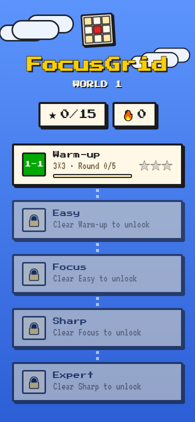
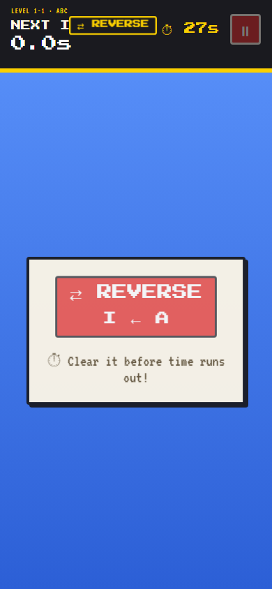
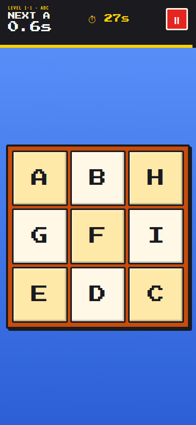
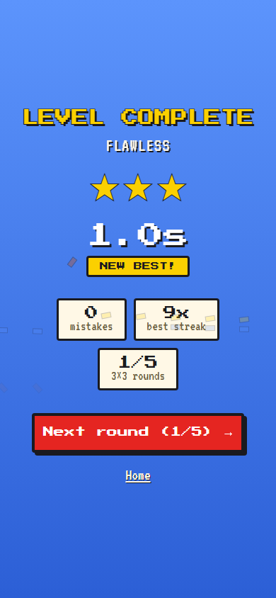

# FocusGrid

A fast-paced attention/reaction-speed trainer, built as a web app with a
retro platformer look. Original design brief: `focus-grid-app-prompt.md`
(written for a native Android build; the gameplay/retention design still
applies — the implementation now lives entirely in `web/`).

Tap the board in order, as fast as you can, before the clock runs out.

## Screenshots

| Home — world map | Pre-round popup |
| :---: | :---: |
|  |  |

| Gameplay | Result |
| :---: | :---: |
|  |  |

## Status

Implemented, in `web/`:

**Core loop**
- Grid sizes 3×3 → 7×7 across 5 stages (Warm-up → Expert), each requiring
  5 completed rounds to unlock the next
- Fisher-Yates board shuffle, 0.1s-precision stopwatch
- Per-round time limit — running out reshuffles the board and restarts the round
- Tap-sequence validation, wrong-tap flash/shake + haptics, pause/resume
- Combo meter for fast consecutive correct taps

**Board variety** (randomized every round)
- Numbers, letters (A, B, ... Z, AA, AB, ...), or — Expert tier only — a
  times table (2× through 12×), never mixed on one board
- Ascending or descending tap order, called out with a highlighted REVERSE
  badge whenever it's active
- A brief (~4.5s) pre-round popup states the mode, sequence range, and
  stakes before the clock starts

**Expert tier**
- Hardcore rule: one wrong tap resets the whole level instantly

**Progression & persistence**
- Every completed run persisted to `localStorage`
- Home screen shows a world-map style stage path with stars (time-based),
  per-stage round progress, and a day-streak
- Result screen: time, mistakes, best-streak, star rating, personal-best
  callout, next-stage/next-round CTA

**Sharing**
- Share buttons for X, Facebook, WhatsApp, Telegram, Reddit, plus copy-link
  (no fabricated share counters)

**Design**
- Retro/pixel-art visual theme (original artwork and iconography, no
  third-party IP), animated retro logo mark, matching favicon
- Responsive layout tuned for mobile (safe-area insets, dynamic viewport
  height, touch targets) and wider screens

Not yet built: Settings screen, Stats/History screen, sound effects,
colorblind-safe palette toggle.

## Building

```
cd web
npm install
npm run dev    # local dev server
npm run build  # production build to web/dist
```

## Testing

No automated test suite yet. Each feature has been manually verified
end-to-end (game flow, pause/resume, wrong-tap/timeout/hardcore-reset
handling, stage unlocking, best-time persistence) across desktop and
mobile viewport sizes via a headless browser.
